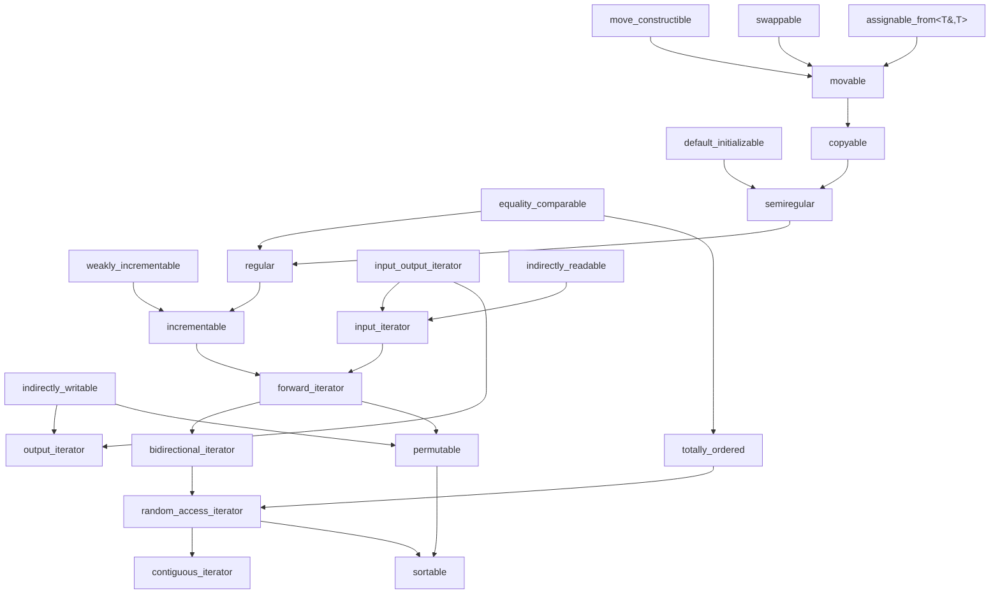

# 第 5 章 详细介绍标准概念

## 5.1 概述
+ 类型和对象 concept
+ 范围、迭代器和算法concept
+ 辅助concept

### 5.1.1 头文件和命名空间
+ `<concepts>`
  + 包含`<ranges>`和`iterator` concept
+ `<iterator>`
  + 包含迭代器concept
+ `ranges`
  + 包含范围(`ranges`) concept
+ `compare`
  + 包含`three_way_comparable` concept
+ `random`
  + 包含`uniform_random_bit_generator` concept
除了`ranges`外, 其他concept都在`std`命名空间中, `ranges`概念在`std::ranges`中.


#### 5.1.1.1 类型和对象的基本概念

| 概念                         | 约束                                       |
| ---------------------------- | ------------------------------------------ |
| integral                     | 整型                                       |
| signed_integral              | 有符号整型                                 |
| unsigned_integral            | 无符号整型                                 |
| floating_point               | 浮点类型                                   |
| ----------------             | ----------------------                     |
| movable                      | 支持移动初始化/赋值和交换                  |
| copyable                     | 支持移动和复制初始化/赋值和交换            |
| semiregular                  | 支持默认初始化、复制、移动和交换           |
| regular                      | 支持默认初始化、复制、移动、交换和相等比较 |
| ----------------             | ----------------------                     |
| same_as                      | 相同类型                                   |
| convertible_to               | 类型可转换为另一类型                       |
| derived_from                 | 从另一类型派生的类型                       |
| constructible_from           | 可从其他类型构造的类型                     |
| assignable_from              | 可从另一类型赋值的类型                     |
| swappable_with               | 类型可与其他类型交换                       |
| common_with                  | 两种类型有一个共同的类型                   |
| common_reference_with        | 两个类型有一个共同的引用类型               |
| ----------------             | ----------------------                     |
| equality_comparable          | 类型支持相等性检查                         |
| equality_comparable_with     | 可以检查两种类型是否相等                   |
| totally_ordered              | 类型支持严格的弱排序                       |
| totally_ordered_with         | 是否可以检查两种类型的严格弱排序           |
| three_way_comparable         | 可以应用所有比较运算符（包括运算符<=>）    |
| three_way_comparable_with    | 可以使用所有比较操作符（包括<=>）          |
| ----------------             | ----------------------                     |
| invocable                    | 类型是指定参数的可调用对象                 |
| regular_invocable            | 类型是指定参数的可调用对象（无修改）       |
| predicate                    | 类型是一个谓词（返回布尔值的可调用对象）   |
| relation                     | 可调用类型定义了两个类型之间的关系         |
| equivalence_relation         | 可调用类型定义了两个类型之间的相等关系     |
| strict_weak_order            | 可调用类型定义了两个类型之间的排序关系     |
| uniform_random_bit_generator | 可调用类型可以用作随机数生成器             |


#### 5.1.1.2 辅助概念

| 概念                  | 约束                         |
| --------------------- | ---------------------------- |
| default_initializable | 类型可默认初始化             |
| move_constructible    | 类型支持移动初始化           |
| copy_constructible    | 类型支持复制初始化           |
| destructible          | 类型是可销毁                 |
| swappable             | 类型可交换                   |
| weakly_incrementables | 类型支持自增操作符           |
| incrementable         | 类型支持保持相等的递增运算符 |


#### 5.1.1.3 范围、迭代器和算法的概念

| 概念                               | 约束                                             |
| ---------------------------------- | ------------------------------------------------ |
| range                              | 类型是一个范围                                   |
| output_range                       | 类型是要写入的范围                               |
| input_range                        | 类型是要读取的范围                               |
| forward_range                      | 类型是一个可多次读取的范围                       |
| bidirectional_range                | 类型是向前和向后读取的范围                       |
| random_access_range                | 类型是一个支持在元素上跳跃的范围                 |
| contiguous_range                   | 类型是在连续内存中包含元素的范围                 |
| sized_range                        | 类型是一个大小支持范围                           |
| common_range                       | 类型是一系列迭代器和相同类型的哨兵               |
| borrowed_range                     | 类型是左值或借用的范围                           |
| view                               | 类型是视图                                       |
| viewable_range                     | 类型或可以转换为视图                             |
| ----------------                   | ----------------------                           |
| indirectly_writable                | 类型可用于写入它所引用的位置                     |
| indirectly_readable                | 类型可用于从其所引用的位置进行读取               |
| indirectly_movable                 | 类型是指可移动的对象                             |
| indirectly_movable_storable        | 类型是指支持临时的可移动对象                     |
| indirectly_copyable                | 类型指的是可复制对象                             |
| indirectly_copyable_storable       | 类型是指支持临时对象的可复制对象                 |
| indirectly_swappable               | 类型指的是可交换的对象                           |
| indirectly_comparable              | 类型指的是可比较的对象                           |
| ----------------                   | ----------------------                           |
| input_output_iterator              | 类型是一个迭代器                                 |
| output_iterator                    | 类型是一个输出迭代器                             |
| input_iterator                     | 类型（至少）是输入迭代器                         |
| forward_iterator                   | 类型（至少）是前向迭代器                         |
| bidirectional_iterator             | 类型（至少）是一个双向迭代器                     |
| random_access_iterator             | 类型（至少）是一个随机访问迭代器                 |
| contiguous_iterator                | 类型是指向连续内存中元素的迭代器                 |
| sentinel_for                       | 类型可以用作迭代器类型的标记                     |
| sized_sentinel_for                 | 类型可以用作迭代器类型的哨点，距离计算的成本较低 |
| ----------------                   | ----------------------                           |
| permutable                         | 类型（至少）是一个前向迭代器，可以对元素重新排序 |
| mergeable                          | 可以使用两种类型将排序后的元素合并为第三种类型   |
| sortable                           | 类型是可排序的（根据比较和投影）                 |
| ----------------                   | ----------------------                           |
| indirectly_unary_invocable         | 操作可以用迭代器的值类型调用                     |
| indirectly_regular_unary_invocable | 无状态操作可以用迭代器的值类型调用               |
| indirect_unary_predicate           | 一元谓词可以用迭代器的值类型调用                 |
| indirect_binary_predicate          | 二元谓词可以用两个迭代器的值类型调用             |
| indirect_equivalence_relation      | 谓词可用于检查传递的迭代器的两个值是否相等       |
| indirect_strict_weak_order         | 谓词可用于对传递的迭代器的两个值排序             |

### 5.1.2 标准概念包含

C++20标准库提供了一系列概念，这些概念之间存在着清晰的层级关系和依赖关系。下面的图表展示了主要标准概念之间的包含关系：



#### 概念层级说明

**基础对象概念层级：**
- `move_constructible`、`swappable`、`assignable_from<T&,T>` → `movable`
- `movable` + `default_initializable` → `semiregular` 
- `semiregular` + `equality_comparable` → `regular`
- `regular` + `weakly_incrementable` → `incrementable`

**迭代器概念层级：**
- `input_output_iterator` 是所有迭代器的基础
- `input_iterator` 和 `output_iterator` 分别处理读取和写入
- `forward_iterator` → `bidirectional_iterator` → `random_access_iterator` → `contiguous_iterator` 形成递进关系

**算法概念：**
- `permutable`：支持元素重排的概念
- `sortable`：支持排序操作的概念

这种层级设计使得概念可以组合使用，形成了一个结构化和模块化的类型约束系统。

## 完整样例代码

```cpp
#include <fmt/core.h>

#include <concepts>
#include <memory>

struct S {
    int x;
    std::unique_ptr<int> ptr;

  public:
    S(int x) : x(x), ptr(std::make_unique<int>(100)) {}
    ~S() = default;
    S(const S &) = delete;
    S &operator=(const S &) = delete;
    S(S &&) noexcept = default;
    S &operator=(S &&) noexcept = default;

    friend void swap(S &a, S &b) noexcept {
        using std::swap;
        swap(a.x, b.x);
        swap(a.ptr, b.ptr);
    }
};

template <> struct fmt::formatter<S> {
    constexpr auto parse(format_parse_context &ctx) { return ctx.begin(); }
    template <typename FormatContext>
    auto format(const S &s, FormatContext &ctx) {
        return fmt::format_to(ctx.out(), "S{{x: {}, ptr: {}}}", s.x,
                              s.ptr ? *s.ptr : 0);
    }
};

template <typename T>
    requires(std::movable<T> && !std::copyable<T> && std::swappable<T>)
void foo(T &&t) {
    fmt::print("Value: {}\n", t);
}

int main() {
    foo(S{1}); // Ok, S is movable
    return 0;
}
```

# reference
+ [concepts](https://en.cppreference.com/w/cpp/header/concepts.html)