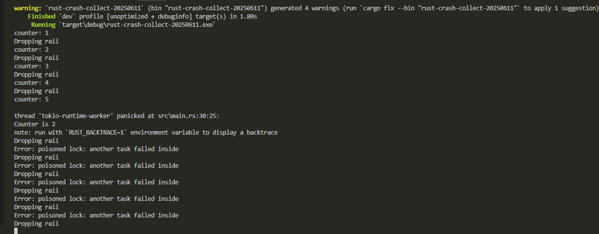

# 记录rust滥用lazy_static导致的一个bug

本质就是lock以后`task crash`后导致其他线程饿死；在cpp20的coroutine也有类似场景

## 目录

- [记录rust滥用lazy\_static导致的一个bug](#记录rust滥用lazy_static导致的一个bug)
  - [目录](#目录)
  - [1. 模拟代码](#1-模拟代码)
    - [1.1 执行结果](#11-执行结果)
  - [2. 解决方案](#2-解决方案)
    - [2.1 如果task不依赖其他组件](#21-如果task不依赖其他组件)
    - [2.2 如果task有依赖](#22-如果task有依赖)
  - [3. 经验](#3-经验)

## 1. 模拟代码
toml
```
[package]
name = "rust-crash-collect-20250611"
version = "0.1.0"
edition = "2024"

[dependencies]
tokio = { version = "1.40.0", features = ["full"] }
lazy_static = "1.5.0"
```

代码
```rust
use std::sync::Mutex;

lazy_static::lazy_static! {
    static ref COUNTER: Mutex<i32> = Mutex::new(0);
}

struct raii {
    name: String,
}

impl Drop for raii {
    fn drop(&mut self) {
        println!("Dropping raii");
    }
}

#[tokio::main]
async fn main() {
    for cnt in 0..10 {
        tokio::spawn(async move {
            let raii = raii {
                name: format!("raii {}", cnt),
            };
            let mut counter = COUNTER.lock();
            match counter {
                Ok(mut counter) => {
                    *counter += 1;
                    println!("counter: {}", *counter);
                    if *counter == 5 {
                        panic!("Counter is 5");
                    }
                }
                Err(e) => {
                    println!("Error: {}", e);
                }
            }
        });
    }
    loop {}
}

```
### 1.1 执行结果
```sh
cargo run
```


## 2. 解决方案
### 2.1 如果task不依赖其他组件
因业务上`tokio`的`spawn`的`task`可以移除`lock`且能够独立，故将变量以`move`的形式实现。

### 2.2 如果task有依赖
暂没思路

## 3. 经验
1. 在multi thread编程中，尽量使用纯函数，不要过多依赖全局变量
2. 如果有依赖尽量使用dag这样的框架，而不是手写依赖
