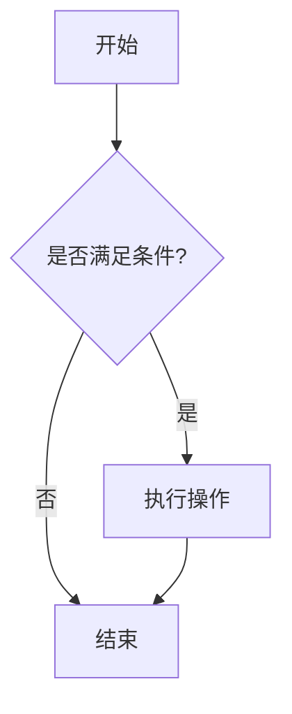

# MkDocs 配置和优化指南

## 目录
- [MkDocs 配置和优化指南](#mkdocs-配置和优化指南)
  - [目录](#目录)
  - [完整配置文件](#完整配置文件)
    - [mkdocs.yml](#mkdocsyml)
  - [功能详解](#功能详解)
    - [导航功能](#导航功能)
    - [搜索功能](#搜索功能)
    - [内容功能](#内容功能)
    - [主题配置](#主题配置)
    - [Markdown扩展](#markdown扩展)
      - [基础扩展](#基础扩展)
      - [PyMdown扩展](#pymdown扩展)
    - [插件配置](#插件配置)
  - [自定义文件](#自定义文件)
    - [自定义CSS](#自定义css)
    - [MathJax配置](#mathjax配置)
  - [依赖配置](#依赖配置)
  - [使用示例](#使用示例)
    - [警告框](#警告框)
    - [任务列表](#任务列表)
    - [标签页](#标签页)
    - [数学公式](#数学公式)
    - [键盘按键](#键盘按键)
    - [表情符号](#表情符号)
    - [代码注释](#代码注释)
    - [详情折叠](#详情折叠)
    - [Mermaid 图表](#mermaid-图表)

---

## 完整配置文件

### mkdocs.yml

```yaml
site_name: 我的文档
site_description: 使用 MkDocs 构建的文档站点
site_url: https://seaflynn.github.io/doc-collect/

theme:
  name: material
  language: zh  # 设置为中文
  features:
    # 导航功能
    - navigation.tabs           # 顶部标签页
    - navigation.tabs.sticky    # 固定标签页
    - navigation.sections       # 导航分组
    - navigation.expand         # 展开所有导航
    - navigation.top            # 回到顶部按钮
    - navigation.instant        # 即时加载页面
    - navigation.tracking       # 地址栏追踪锚点
    - navigation.indexes        # 分组主页
    
    # 搜索功能
    - search.highlight          # 搜索高亮
    - search.share             # 搜索分享
    - search.suggest           # 搜索建议
    
    # 内容功能
    - content.tabs.link        # 内容标签页链接
    - content.code.copy        # 代码复制按钮
    - content.code.annotate    # 代码注释
    - content.action.edit      # 编辑此页
    - content.action.view      # 查看源码
    
    # 头部功能
    - header.autohide          # 滚动时自动隐藏头部
    
    # 表格功能
    - content.table            # 表格排序
  
  palette:
    # 浅色模式
    - media: "(prefers-color-scheme: light)"
      scheme: default
      primary: indigo
      accent: indigo
      toggle:
        icon: material/brightness-7
        name: 切换至深色模式
    # 深色模式
    - media: "(prefers-color-scheme: dark)"
      scheme: slate
      primary: indigo
      accent: indigo
      toggle:
        icon: material/brightness-4
        name: 切换至浅色模式

  icon:
    repo: fontawesome/brands/github
    edit: material/pencil 
    view: material/eye

# 仓库信息
repo_url: https://github.com/seaflyNN/doc-collect
repo_name: seaflyNN/doc-collect
edit_uri: edit/main/docs/

markdown_extensions:
  # 基础扩展
  - abbr                    # 缩写
  - admonition             # 警告框
  - attr_list              # 属性列表
  - def_list               # 定义列表
  - footnotes              # 脚注
  - md_in_html             # HTML中的Markdown
  - tables                 # 表格
  - toc:
      permalink: true
      toc_depth: 3
      
  # PyMdown 扩展
  - pymdownx.arithmatex:   # 数学公式
      generic: true
  - pymdownx.betterem:     # 改进的强调
      smart_enable: all
  - pymdownx.caret         # 插入符号
  - pymdownx.details       # 详情折叠
  - pymdownx.emoji:        # 表情符号
      emoji_index: !!python/name:material.extensions.emoji.twemoji
      emoji_generator: !!python/name:material.extensions.emoji.to_svg
  - pymdownx.highlight:    # 代码高亮
      anchor_linenums: true
      line_spans: __span
      pygments_lang_class: true
  - pymdownx.inlinehilite  # 行内代码高亮
  - pymdownx.keys          # 键盘按键
  - pymdownx.mark          # 标记
  - pymdownx.smartsymbols  # 智能符号
  - pymdownx.snippets      # 代码片段
  - pymdownx.superfences:  # 代码围栏
      custom_fences:
        - name: mermaid
          class: mermaid
          format: !!python/name:pymdownx.superfences.fence_code_format
  - pymdownx.tabbed:       # 标签页
      alternate_style: true
  - pymdownx.tasklist:     # 任务列表
      custom_checkbox: true
  - pymdownx.tilde         # 删除线

# 插件配置
plugins:
  - search:
      separator: '[\s\u200b\-_,:!=\[\]()"`/]+|\.(?!\d)|&[lg]t;|(?!\b)(?=[A-Z][a-z])'
  - git-revision-date-localized:
      enable_creation_date: true
      type: datetime
      locale: zh

# 额外配置
extra:
  generator: false  # 隐藏"Made with Material for MkDocs"
  social:
    - icon: fontawesome/brands/github
      link: https://github.com/seaflyNN
    - icon: fontawesome/brands/twitter
      link: https://twitter.com/yourhandle
  analytics:
    provider: google
    property: G-XXXXXXXXXX  # 替换为您的Google Analytics ID

# 自定义CSS和JS
extra_css:
  - ../assets/stylesheets/extra.css

extra_javascript:
  - ../assets/javascripts/mathjax.js
  - https://polyfill.io/v3/polyfill.min.js?features=es6
  - https://cdn.jsdelivr.net/npm/mathjax@3/es5/tex-mml-chtml.js

nav:
  - 首页: index.md
  - 文档写作:
    - Markdown 入门到入土: tag_markdown用法/markdown入门到入土.md
  - 前端:
    - 错误记录:
      - TailwindCSS错误记录: 前端/错误记录/err-tailwindcss.md
  - 关于AI:
    - b站:
      - 周鸿祎-AI创业-百大AI应用系列视频博客: 关于AI/b站/周鸿祎-ai创业-百大AI应用系列视频博客.md
  - 杂项:
    - 本地构建docsify: 杂项/本地构建docsify.md
    - 本地构建mkdocs: 杂项/本地构建mkdocs.md
    - vscode插件: 杂项/vscode-插件.md
    - Oh-My-Posh安装: 杂项/Oh-My-Posh安装.md
    - win终端插件安装: 杂项/win-类fish.md
    - MkDocs配置和优化: 杂项/mkdocs-配置和优化.md
  - cpp:
    - cpo: cpp/cpo.md
  - QT:
    - qml笔记: QT/qml笔记.md
    - 笔记: QT/笔记.md
    - qml-background-contentitem-分离: QT/qml-background-contentitem-分离.md
    - qt-qml常用组件: QT/qt-qml常用组件.md
```

## 功能详解

### 导航功能

| 功能 | 说明 |
|------|------|
| `navigation.tabs` | 在页面顶部显示导航标签页 |
| `navigation.tabs.sticky` | 标签页在滚动时保持固定 |
| `navigation.sections` | 将导航项目分组显示 |
| `navigation.expand` | 默认展开所有导航分组 |
| `navigation.top` | 显示回到顶部按钮 |
| `navigation.instant` | 启用即时页面加载（无刷新跳转） |
| `navigation.tracking` | 在地址栏追踪当前锚点 |
| `navigation.indexes` | 支持分组主页 |

### 搜索功能

| 功能 | 说明 |
|------|------|
| `search.highlight` | 在搜索结果中高亮关键词 |
| `search.share` | 添加搜索分享功能 |
| `search.suggest` | 显示搜索建议 |

### 内容功能

| 功能 | 说明 |
|------|------|
| `content.tabs.link` | 内容标签页支持链接 |
| `content.code.copy` | 代码块添加复制按钮 |
| `content.code.annotate` | 支持代码注释功能 |
| `content.action.edit` | 每页添加"编辑此页"按钮 |
| `content.action.view` | 添加"查看源码"按钮 |
| `content.table` | 表格支持排序功能 |

### 主题配置

- **语言设置**: `language: zh` - 界面显示为中文
- **配色方案**: 
  - 浅色模式: `scheme: default`, `primary: indigo`
  - 深色模式: `scheme: slate`, `primary: indigo`
- **模式切换**: 自动检测系统偏好，支持手动切换
- **图标设置**: GitHub、编辑、查看等图标

### Markdown扩展

#### 基础扩展
- `abbr`: 缩写支持
- `admonition`: 警告框和提示框
- `attr_list`: HTML属性列表
- `def_list`: 定义列表
- `footnotes`: 脚注支持
- `tables`: 表格支持
- `toc`: 目录生成（支持永久链接）

#### PyMdown扩展
- `arithmatex`: 数学公式支持（LaTeX语法）
- `betterem`: 改进的强调语法
- `emoji`: 表情符号支持
- `highlight`: 代码语法高亮
- `keys`: 键盘按键样式
- `superfences`: 代码围栏（支持Mermaid图表）
- `tabbed`: 标签页内容
- `tasklist`: 任务列表支持

### 插件配置

- **搜索插件**: 改进的中文分词支持
- **Git修改时间**: 显示文件创建和修改时间

## 自定义文件

### 自定义CSS

文件位置: `docs/stylesheets/extra.css`

```css
/* 自定义样式 */

/* 改善代码块样式 */
.highlight pre {
  border-radius: 6px;
}

/* 改善表格样式 */
.md-typeset table:not([class]) {
  box-shadow: 0 0.2rem 0.5rem rgba(0,0,0,.05);
  border-radius: 6px;
  overflow: hidden;
}

/* 改善警告框样式 */
.md-typeset .admonition {
  border-radius: 6px;
  box-shadow: 0 0.2rem 0.5rem rgba(0,0,0,.05);
}

/* 自定义滚动条 */
::-webkit-scrollbar {
  width: 6px;
}

::-webkit-scrollbar-track {
  background: #f1f1f1;
}

::-webkit-scrollbar-thumb {
  background: #c1c1c1;
  border-radius: 3px;
}

::-webkit-scrollbar-thumb:hover {
  background: #a8a8a8;
}

/* 改善标签页样式 */
.md-typeset .tabbed-set {
  border-radius: 6px;
  overflow: hidden;
  box-shadow: 0 0.2rem 0.5rem rgba(0,0,0,.05);
}

/* 改善任务列表样式 */
.md-typeset .task-list-item {
  list-style-type: none;
}

.md-typeset .task-list-control [type=checkbox] {
  margin-right: 0.5rem;
}
```

### MathJax配置

文件位置: `docs/javascripts/mathjax.js`

```javascript
window.MathJax = {
  tex: {
    inlineMath: [["\\(", "\\)"]],
    displayMath: [["\\[", "\\]"]],
    processEscapes: true,
    processEnvironments: true
  },
  options: {
    ignoreHtmlClass: ".*|",
    processHtmlClass: "arithmatex"
  }
};

document$.subscribe(() => {
  MathJax.typesetPromise()
})
```

## 依赖配置

文件位置: `requirements.txt`

```
mkdocs==1.6.1
mkdocs-material==9.6.14
mkdocs-material-extensions==1.3.1
pymdown-extensions==10.15
markdown==3.8
mkdocs-git-revision-date-localized-plugin==1.2.0
```

## 使用示例

### 警告框
```markdown
!!! note "提示"
    这是一个提示框

!!! warning "警告"
    这是一个警告框

!!! danger "危险"
    这是一个危险警告框
```

### 任务列表
```markdown
- [x] 已完成的任务
- [ ] 待完成的任务
- [ ] 另一个待完成的任务
```

### 标签页
使用四个反引号来展示嵌套的代码块：

````markdown
=== "Python"
    ```python
    print("Hello World")
    ```

=== "JavaScript"
    ```javascript
    console.log("Hello World");
    ```

=== "Bash"
    ```bash
    echo "Hello World"
    ```
````

### 数学公式
```markdown
行内公式：\(E = mc^2\)

块级公式：
\[
x = \frac{-b \pm \sqrt{b^2 - 4ac}}{2a}
\]
```

### 键盘按键
```markdown
按 ++ctrl+c++ 复制代码
按 ++ctrl+v++ 粘贴代码
按 ++alt+tab++ 切换窗口
```

### 表情符号
```markdown
:smile: :heart: :thumbsup: :rocket: :fire:
```

### 代码注释
使用四个反引号来展示嵌套的代码块：

````markdown
```python
def hello_world():  # (1)
    print("Hello World")  # (2)
```

1. 这是函数定义
2. 这是打印语句
````

### 详情折叠
```markdown
??? note "点击展开详情"
    这里是折叠的内容，点击标题可以展开或折叠。
    
    可以包含任何 Markdown 内容。
```

### Mermaid 图表
使用四个反引号来展示嵌套的代码块：

````markdown

```` 